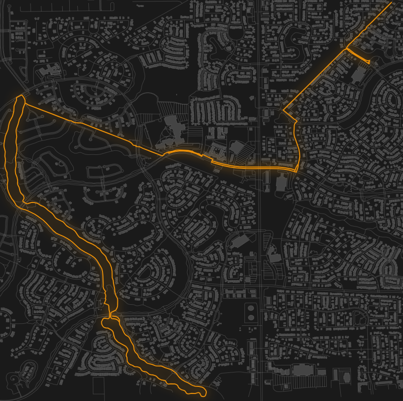

I wanted to generate black-and-white maps of the bike routes I take, so I built a tool that reads the routes as GeoJSON data and uses the Overpass API to generate the maps.

You can generate the routes using a service like [geojson.io](https://www.geojson.io)

